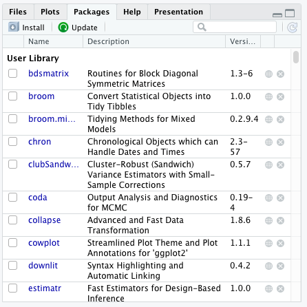

# Functions, Packages, and Doing Stuff with Data {#ch6}

In this chapter: 

- Basic anatomy of functions in Base R 

- Installing and importing packages 

- Error messages and navigating help files

- Basic code debugging 

## There's a package for that: the endless possibilities outside of base R 

We call the built-in functions that do not require any additional specification or installation "Base R." However, given the expansion of R's use across many fields and the rapidly evolving landscape of computational sciences, developers and programmers have built easy-to-install software distributions compatible for use as functions *within* R. We reference these additional features as **packages**. 

Packages typically contain a number of different functions with a similar basic structure that are created with a similar theme or goal in mind. For example, the `plm` package is specifically for modelling panel data; that is, data that considers the same variables over time. Another example is the package `clubSandwich`, which estimates additional types of standard errors for different models and tests whether a model is still significant given the updated standard error. Other packages provide additional tools for reshaping and manipulating data, visualizing data, or dealing with less standard forms of data. 

Nowadays, Base R is really quite limited in what it can achieve relative to some of these additional packages. Therefore, literacy in what certain packages are useful for will be an important skill to develop. Here we will focus on how to install and access these additional packages, with specific emphasis on a package that will be useful in the chapters to come-- the `tidyverse` and `dplyr`. Both of these are packages that have become typical 

To perform the initial simple install of a package, you will merely run the call `install.packages("")`. This call downloads the package from the CRAN, the repository of R related "stuff" we mentioned in Chapter \@ref(ch2). When you run this code, you will see a string of script run in the console. This is normal and not something you really need to pay attention to unless there is an error, which R will alert you of. 

Some packages take longer than others to install, and oftentimes installing packages requires that R also installs a package's **dependencies**. Dependencies are additional packages that are necessary for the specified package to run. In some cases, R will need your further permission to download and install dependencies. On one hand, you can choose to allow the dependencies to be downloaded *ad hoc*, that is at the time when prompted to download the package dependencies. On the other hand, you can specify that R downloads the dependencies in the original call itself. We have demonstrated both of these options below. 

Try both of these options in your own script to get a feel of what installing a package looks like! 

```{r, eval=F}
# install the tidyverse package from CRAN without specifying any additional actions 
install.packages('tidyverse')

# install the tidyverse package including the package dependencies
install.packages('tidyverse', dependencies = T)
```

Once you have successfully downloaded a package, you will need to tell R that you want to access that package. Much like objects, packages are only available in R memory during each session. This is to say, if you close R or turn off your computer, etc., you will need to reload every package required for each script. There are two ways to load packages. 

1) First, you can simply run the function call `library()`. Notice here that unlike the `install.pacakges()` function, the `library()` call does not require that you put the package name in quotation marks. 

- R has another function call for accessing packages that acts nearly the same as `library()`: `require()`. These two codes are nearly interchangeable with a few small differences, `library()` is preferred here merely out of habit.  

2) Alternatively, you can go to the **Packages** pane in the right-hand, bottom side of RStudio and search for the package that you want to interact with, and check the box next to its name. The second option is less the norm, but is useful if you want to check the package version you are have downloaded. 



See what happens when you try each of the above options on the package `psych`, a package you have likely not yet downloaded. 

```{r, eval= F}
# first with library()
library(psych)

# now with require()

require(psych)

# now try the point-and-click method in the bottom right-hand pane. 
```

More advanced ways are out there to install packages, especially for packages not housed in the CRAN. For example, the `devtools` package allows you to download packages in development directly from Github. These types of installs are a little out of the scope here, but useful to know about for future development in your programming skills. 

## Help Files 

You will organically learn about the myriad packages necessary to complete the computational work necessary to achieve your analysis goals. These things come up in reading, StackExchange forums, or conversations with grad school colleagues. However, knowing the packages to install is only half the battle. You must also understand the functions available in each package, and the syntax required to run these functions.

Packages housed on the CRAN all have easy to access .pdfs called R Documentation that will usually pop up when you search Google for the package name + "R file" or something along those lines. Skimming through the full R documentation is the most thorough way to expose yourself to a new package, but likely overkill in some cases. However, this is recommended as you acquaint yourself with R syntax or in the case that an entire package seems particularly useful for your needs. 

In the case that you are really just curious or stumped about a particular function, you can access help files directly from R. There are two methods to do this, again one is programmatic and the other is point-and-click in R studio. For this example, let's think about the `dplyr` package, which is an auxiliary package you downloaded when you installed `tidyverse`. `dplyr` contains the function call `anti_join()` which merges two datasets based on the rows in one that do not match the other. For those that were paying attention to our chapter on set theory, an anti-join finds the elements of X that are not in Y-- or the non-intersecting elements of X. But, knowing what a function does will not necessarily tell you how the syntax goes in the function call and the following methods are ways you might access more information.

1) Specify in R code that you want to know more about the function in the simple call `?<function>` or `help()`. So, in this example you would merely run `?anti_join` or `help(anti_join)`. If you'd like to specify which package the function is a part of, because in some cases functions will share the same name, you can also specify the package `help(anti_join, package="dplyr")`.  

2) Visit the **Help** tab on the bottom, right-hand panel and type the function in question. If there is only one function associated with that name, the appropriate help file will pop up in that pane with the information about the function. If there is more than one function with that name, there will be a list of functions and their respective packages. Click on the hyperlink of the appropriate package/function pair and the help file will pop up in the pane.  

In either method, R will produce the help files associated with the function in question in the **Help** pane again on the bottom, right-hand side of the RStudio interface. This help file provides information on the syntax, the definition of each argument in the syntax, and what the output means. Furthermore, these help files include examples, referred to as vignettes, that help you to see the functions in action with some notated code. In most cases, these help files will be sufficient to help you understand how a function works at a basic level. However, if the files are unclear or you need a bit more of a walk through, StackExchange or other forums are better for more detailed information.

## Dealing with Twins

As we alluded to in the previous section, sometimes you will encounter two functions that have identical names but you will need to make use of *both* packages containing these functions in the same script. When this happens, R's default behavior is  to choose one function to prioritize over the other, resulting in one of the functions being **masked**.

Fear not, as you can still coerce R to use your preferred function when writing your script with qualified imports. Let's again revisit an example in `dplyr` and another popular package `Hmisc`. Both of these packages contain functions called `summarize()`. If you want to be able to use `dplyr`'s `summarize()` on one line and then use `Hmisc`'s on the next, you would merely specify that as part of the function with `::`. See below for what this looks like. Note that just because functions share names *does not* imply that they will perform the same computational operation.  

```{r, eval=F}
# qualified imports in R for packages with twin function names 

# dplyr's variant first, let's summarize the potato_weight variable  

dplyr::summarize(potatoes_info, mean_pw=mean(potato_weight))

# now let's use the Hmisc variant 

Hmisc::summarize(potatoes_info$potato_weight, by=potatoes, FUN=mean)

# you can also use this qualified import in your call for a help file 

?dplyr::summarize 

?Hmisc::summarize
```
