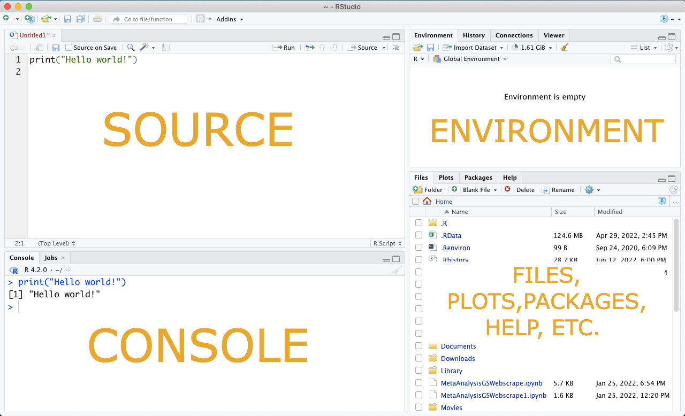

# Getting Started {#ch2}

In this chapter: 

- Installing R and RStudio IDE 

- Starting a script in RStudio 

- Installing Python and Pycharm IDE 

- Starting a new project and Python script in PyCharm 


## Installing and Familiarizing Yourself with R and RStudio

Before working through any of the remaining text you will need to complete a couple of crucial steps. You need to ensure that you have access to all of the computational programs that the text will cover. First, we will cover the installation of R and the RStudio integrated development environment. 

### R 

R is downloadable via the [CRAN (Comprehensive R Archive Network)](http://ftp.ussg.iu.edu/CRAN/). Aside from housing the R base distribution, CRAN also houses additional help files on the myriad packages that are available for download once you have access to the base system-- more on that later! You will need to choose the R distribution download suitable for your operating system (i.e. macOS, Windows, or Linux). Go ahead and follow the instructions at the download link, ensure that the program downloads properly, and stored in a familiar location on your computer. 

### RStudio 

Next, visit the [RStudio](https://www.rstudio.com/products/rstudio/download/) site. RStudio is an environment that makes working in R and other programs a little more manageable. As you might have seen if you opened R after download, the base R platform is very simple. RStudio instead has a structured setup that allows for file and visualization management, cataloging package help files, and integration with additional programs in a single screen, all while still maintaining the basic functionality of R. 

When downloading RStudio, it is up to you whether you use the Server or Desktop version. Once you make your choice among these options, follow the download guidelines given your operating system and ensure again that the program stores in a familiar location on your computer. 

### Navigating RStudio  

Upon completing download of both R and RStudio, you may open up RStudio and browse around. You will see that the RStudio interface has 4 primary panes. 

{width=90%}

1. In the **SOURCE** pane, you will write editable and savable scripts of code. RStudio further lets you operate with different types of source codes depending on the specific script file that you open. We will visit this later when we talk about RMarkdown and other potential uses of RStudio outside of analyses. All R source code has the file format ".r". 

- To run a line of code, you can either click the **Run** button at the top of the script pane, or press `Cmd/Ctrl + Enter` on your keyboard, while your cursor is on the line of code. To run chunks of your script, you can highlight the relevant code and then perform this same operation while the code text is highlighted. To run the full script you can simply press `Cmd/Ctrl + Shift + Enter`. 

- Commenting on your code is one of the most important practices to develop early on in programming. To do so in R, simply begin a line of code with `#`. This will prevent the program from running whatever is written at that line in the script. Note that for every line of comments you will need to input a new `#`. 

```{r, include =T, eval=FALSE}
# Imagine here is where I am going to put information about this variable. 
wars_1920 

# And here is where I will explain why I ran this test. 
t.test(wars_1920~industrial)
```


2. The **CONSOLE** is the default location to display code output as well as previously run code. You can also run code in the console itself, however this is not advisable as earlier codes cannot be edited, and you cannot save an editable script as is possible in the source pane. Running code sometimes also takes a long time or is prone to bugs, while you run code a **STOP** sign will appear in the upper right hand corner of the console. Should you need to force stop code, pressing this stop button should discontinue the operation. 

3. The R **ENVIRONMENT** contains the names and details of all objects that have been programmed into R's local memory. For example, let's say you created a variable named `potatoes` that contained the names of all different types of potatoes. The environment pane would contain this variable name and some meta-data about how many different values were observed in the variable (e.g. the variable length). Or, let's say you imported a dataset called `potato_information`. In the case of the dataset, the environment tab would provide information on the dimensions of the dataset given the number of total variables and observations. The R environment panel also has a few other tabs for history, connections, Git, and object viewing. These tabs are not immediately relevant and we will address them later in the text, as necessary.

](potatoes_data.png){width=90%}

```{r, eval=F, include=F}
potatoes<-c("Adirondack Blue", "Adirondack Red", "Agata", "Agria", "Ajanhuiri", "Almond", "Alpine Russet", "Alturas", "Amandine", "Allians", rep("s", 4990))
potato_weight<-rpois(5000, 15)
location<-c("US", "US", "Netherlands", "", "Bolivia", "Sweden", "", "US", "France", "Germany", sample(codelist$cow.name, 4990, replace=T))
potatoes_info<-data.frame(potatoes, potato_weight, location)
```

4. The **FILES, PLOTS, PACKAGES, HELP** is another multi-use pane, with tabs that will likely all be relevant to you. The *Files* tab will allow to open and interact with files that are available in your directories accessible from your local, git, or cloud workspace. The *Plots* tab displays all the image or graph outputs from the source code. The *Packages* tab lists all the installed packages, with checkboxes that indicate whether or not the package has been loaded for use. Finally, the *Help* tab allows access to all R package help files avaible on the CRAN. You can query a specific package's help file in the search bar on the Help tab, or you can call for a specific help file in the source code or console. More on these topics will be addressed in the chapters to come. 

You can customize the available tabs. For example, you might integrate your Git account with RStudio, as we cover later. This and other custom features are available to play around with in the RStudio Preferences. 

To begin writing and editing code in R, you will click the blank page icon in the top left hand corner. When a drop down menu gives you a number of options to choose from, choose **R Script**. There are other options of new sheets that you can open and edit in R, but for now we will focus on the most basic script. From now and through the rest of this course, you should assume that R usage and coding activities will be moderated via RStudio, as opposed to the base R program. 

### Why R? 

Oftentimes, students ask *why* they will learn R rather than other potential statistical analysis programs, such as STATA. The easy and clearest answer is that R and it's cognate applications are all open source. This means that R and any additional packages in R are free to use. In addition to being free, open source coding also means that the back-end development codes are open and free to reproduce and modify. 

R's package diversity, data visualization capabilities, and relative age to other programs are also reasons that we might argue for the emphasis on R. Other open source languages, such as Python, are quickly becoming relevant to social scientists in both academic and non-academic contexts. However, these languages are not yet as widely popular. Therefore, it may take some time before languages such as Python become as accessible and necessary for training in quantitative social science.  

## Installing and Familiarizing Yourself with Python 

As graduate education modernizes itself toward training for both academic and non-academic jobs, teaching programming literacy beyond just R is essential. So, we will also cover some basics of the Python coding language as well. As mentioned, Python is newer on the scene generally and especially among social sciences. This means that resources available to make Python legible to social scientists in training is still being built up. We hope that some of the text here at least exposes you enough to Python and one available Python interface such that you might pursue further training later on, if desired. 

### Python 

First, if you are a Windows user you will download the latest version of [Python](https://www.python.org/downloads/), or at least Python 3. Just like R and RStudio, be sure to download the correct version for your operating system. Mac and Linux users already have Python, but if you run into any problems just try and download Python. Once you have downloaded Python, make sure you downloaded it to a location on your computer that makes it easy to find again. Otherwise, there is no need to open any program after download.  

### PyCharm IDE 

Just like with R and RStudio, we will rely on an integrated development environment to help cushion the interaction with Python, which otherwise has a very minimalist interface. [PyCharm](https://www.jetbrains.com/pycharm/) is a great IDE for beginners that don't want to stick to RStudio for Python projects, but still want a well-built environment. We encourage you to check out Reddit and other message board threads on what IDEs might be better suited for your particular goals with Python as you become more familiar with it. Visit the PyCharm site, download the suitable version, and read through the documentation. There are a couple of different versions for download, we recommend that you opt for the open-source *Community* version. Though PyCharm is more developed than other potential interfaces for Python, the structure is still quite opaque for those new to coding-- even for those of us that have been around R for a while. So read through what you can about getting started, and when we revisit Python in later chapters, we hope that things will come together smoothly. 

When you open PyCharm, you will be prompted to start a new project, open an existing project in a local working directory, or work with a project in version control. For now, start a new project without modifying any of the additional selections in the prompt. Once you hit "Create" you will encounter the following screen:

{width=90%}

On the left hand side is a file tree, with all project related scripts and files. The right hand side is the source script or editable code. In the case that you want to start a new Python script instead of the welcome script shown here, simply choose File $\rightarrow$  New... $\rightarrow$ Python File. As you may notice, Python code files have the file format ".py". Along the bottom edge, you will see a few options to toggle for additional panels related to version control, to dos, packages, etc. All in all, it is much like the pane system integrated into RStudio. PyCharm has additional add-ons that you can generate and customize yourself. Again, we recommend that you take a look at the documentation on the PyCharm site should you want to be more advanced in that environment. 

## Moving Forward 

The remainder of this text will focus primarily on R and then later on some basics of Python. But first we are going to take a quick detour into Github and <span class="latex">L<sup>A</sup>T<sub>E</sub>X</span>: two additional software distributions that will also be important to develop scientific research both in and out of academia. 


