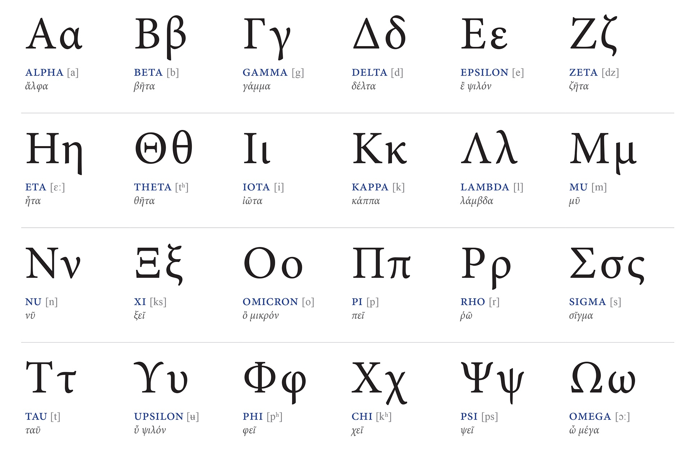

# Day 2 Agenda

- Scientific method

- Sets and Set Operations

- Logical operators and systems 

# Theory Construction 

Social scientists are tasked with developing and testing **theories** that explain certain patterns that exist in the social world. 

## Theory 

A **theory** is a proposition or set of propositions that explain a certain phenomenon in the world. Theories can be either *causal* or *descriptive*, though more work in contemporary social science is now oriented toward causal explanation. 

Typically, a theory specifies a number of **concepts** of interest and explains the relationship between them. The way social scientists define theoretical concepts depends on previous scientific work on that phenomenon and their manifestation in real life. 

# Theory Construction 

Empirical social scientists evaluate whether or not theories are true through hypothesis testing. Hypothesis testing is a systematic method of discerning if observed evidence favors the developed theory or not. 

## Hypothesis and Null Hypothesis 

A **hypothesis** is an observation we would expect if a theory is true. 

A **null hypothesis** is the corresponding observation we would expect if the theory is *not* true. 

A hypothesis will usually specify the proposed nature of a relationship between two or more **variables**, which are the empirical stand-ins for theoretical concepts. These are the real world **things** that compose our theory. 

# Variables and their Functional Roles 

Theories explain why and how one variable varies depending on the character or value of another variable. This means we have a particular nomenclature to refer to variables given their functional role. 

- The **dependent variable** (Y) is the outcome of interest, whose value is expected to depend on some other variable. The dependent variable may also be referred to as the outcome or response variable.

- The **independent variable** (X) is the theorized cause of the dependent variable, or at least the cause of Y's variation. The value of the independent variable is expected to be independent of variation in Y. 

# Operationalization 

Adequately building and testing theories requires that we think of real-world ways to measure the variables of interest.

For example, we might be abstractly interested in *socioeconomic inequality.* But, there are **many** ways to measure this concept.

Therefore, when we think of **operationalizing** socioeconomic inequality, we need to choose a fixed, systematic measure of this concept to help us identify instances of socioeconomic inequality. 

# Theory Construction, An Example 

Let's say we have a theory that public approval of politicians is not grounded only in their present political careers. Instead, we conjecture that politician approval is also dependent on their social networks preceding their political careers. Specifically, we expect that politicians with previously public lives receive higher levels of public approval through their political term than those who did not have public lives prior. 

>- What is a hypothesis that we can derive from this theory? 

>- What variables constitute the hypothesis? 

# Theory Testing

To conduct hypothesis tests that help put our theory to the test, we need an empirical method to evaluate each hypothesis's veracity with collected data. A theory's contribution to knowledge and understanding of the world depends on how well the theory performs under these hypothesis tests. 

- Empirical methods can be either *qualitative* or *quantitative* in nature-- here we focus on the latter. 

- Quantitative methods use numerical analyses to determine whether the accumulated evidence favors the hypothesis proposed or the null. Our default is to *favor the null*, and the burden is on the data to show otherwise. 

- This class will focus specifically on quantitative methods based in probability and statistics. 

# From Theory to Empirics 

- Each observation or occurrence of our variables of interest is a piece of *data.* 

- When we think about observing quantitative data, there are a lot of things to keep in mind: the bounds, the set of possible values, quantifying abstract concepts, and more. 

- While we will use applied probability and statistics to reach conclusions about our data, there are intermediate steps and additional keys to navigating the inter-related processes of data collection and analysis. 

- These intermediate steps are based in logic, set theory, algebra, calculus, etc. We will introduce or re-introduce all of these constitutive parts so that once we get to the coursework in 403 and beyond, you can always revisit this material to make sense of the foundations of more advanced methods. 

# Sets and Logical Possibilities  

## Sets 

A collection of elements. 

# Types of numerical elements in a set

\small 

- Natural numbers, $\mathbb{N}$: positive whole numbers, including 0
  
  - $\{(0), 1, 2, 3, ... \}$ 

- Integers, $\mathbb{Z}$: negative and positive numbers including zero
  
  - $\{..., -3, -2, -1, 0, 1, 2, 3, ... \}$

- Rational numbers, $\mathbb{Q}$; any number that can be represented by the quotient p/q

  - $\{1/2, 4, -3, 3/2\}$ 

- Real numbers, $\mathbb{R}$: any point on the number line

  - $\{-899.8, 22, 4/5, \sqrt{\pi}\}$ 

- Imaginary numbers, $\mathbb{I}$: a number times the imaginary number $i$, which has no meaningful value, $i=\sqrt{-1}$ 

- Complex numbers, $\mathbb{C}$: a value consisting of both a real and imaginary number, often in the form $a+bi$ 

# Elements in a set

You can have a set composed of other *things* too. Such as names of people, places, or other things. 

Sometimes you will code these non-numerical values to have numerical representation, other times you will leave the names as is. These distinctions will become more clear moving forward and in your coding instruction. 

# Measurement

- Nominal: no mathematical relationship between the variables

- Ordinal: categorical variable with set, non-numeric relationship between values, order of numbers is meaningful 

- Interval: equidistant from one value to the next, but there is not meaningful zero 

- Ratio (interval-ratio): equidistant from one value to the next, there is a meaningful zero

# Measurement: Examples

Here are some examples of each of these types of measurements: 

>- Nominal: Eye color or Name 

>- Ordinal: Rating degree of agreement with a new public policy on a scale from 0 (disagree completely) to 7 (agree completely)

>- Interval: Most standardized test scores (SAT, ACT, TOEFL, GRE, IQ, etc.)

>- Ratio: Number of tax dollars spent per person in a municipality 

>- What are some other examples of each of these types of measurements of variables? 

# Sets, Variables, and Sample Spaces

>- How does this make sense in probability and statistics? 

>- We measure and assign values to variables. When we conduct this data accumulation process, how we measure something and the bounds of its measurement are consequential to how we then analyze it.

>- Knowing how to characterize variables is important to understand the following concepts: 

  >- Solution set: set of all solutions to an equation
  
  >- Sample space: set that contains all the values a variable can take
  
  >- Subsets: subgroups of a set or sample space

# Set Notation  

Sets and set operations have notation conventions: 

- There exists, $\exists$ for all, $\forall$

- Union $\cup$, Intersection $\cap$ 

- Excluding $\notin$, $\neg$

- Empty set $\emptyset$

- Element $\in$

- Equivalent $\equiv$

- Such that (s.t) or $|$, e.g. $\{x | x>7\}$

- Subset $\subset, \subseteq$ (these function roughly like the less than/less than equal to, but for sets)

# Displaying Sets 

>- Roster notation: $\{x_1, x_2, ... \}$, simply lists out the elements of the set 

>- Set builder notation: $\{ x | x \in N, x<4 \}$, uses set notation to specify the parameters of the set 

  >- Try one: $A = \{x | x \in \mathbb{R}, x < 200\}$
  
  >- Read "Set A is a set of all x such that x is a real number less than 200." 

# Characterizing Sets 

>- **Open sets** have a fuzzy boundary. This is the set version of open brackets (). **Closed sets** have clear and firm boundary. This is the set version of closed brackets [ ]. 

>- Finite (finite number of elements) or Infinite (no limit)

>- Countable or Uncountable: elements can be counted or not (e.g $\{ 0,1\}$ is countable )

>- Ordered and Unordered sets: ordered set has significance in order while in unordered, no significance in ranking

# Characteristics of Sets 

- Subset: elements of some sets are contained within a second set, e.g. even integers and integers. (proper subset: $\subset$, subset: $\subseteq$)

- Cardinality: number of elements

  - Singleton: one element

- Empty set: no elements. 

  - $A=\emptyset$ is VERY different from $A=\{ \emptyset \}$

- Universal set (the universe: all elements)

# Sets and Set Operations 

Now that we know a bit about what sets *are*, we can now visit what to *do* with sets.

::: {.block}
## **Union**: $A \cup B$ 

Joining two sets together, the equivalent of adding all of the elements of each set. 

Here we highlight all of the elements in $A$ **OR** $B$. 
:::

\begin{center}
\begin{tikzpicture}
      \begin{scope}
    \clip \firstcircle;
    \fill[cyan] \firstcircle;
      \end{scope}
      \begin{scope}
    \clip \secondcircle;
    \fill[cyan] \secondcircle;
      \end{scope}
      \draw \firstcircle node[text=black,above] {$A$};
      \draw \secondcircle node [text=black,above] {$B$};
\end{tikzpicture}
\end{center}

# Sets and Set Operations 

::: {.block}
## **Intersection**: $A \cap B$ 

Finding the elements in sets or subsets that are shared, i.e. that intersect. 

Here we highlight all of the elements in $A$ **AND** $B$. 
::: 

\begin{center}
\begin{tikzpicture}
      \begin{scope}
    \clip \firstcircle;
    \fill[cyan] \secondcircle;
      \end{scope}
      \begin{scope}
    \clip \secondcircle;
    \fill[cyan] \firstcircle;
      \end{scope}
      \draw \firstcircle node[text=black,above] {$A$};
      \draw \secondcircle node [text=black,above] {$B$};
\end{tikzpicture}
\end{center}

- Two or more sets are **disjoint** if their intersection is empty, i.e. $A \cap B = \emptyset$. What might the Venn diagram of disjoint sets look like? 

# Sets and Set Operations 

::: {.block}
## **Difference**: A-B 

The elements of one set less the elements of another. 

Here we show the difference between sets A and B ($A-B$). 
:::

\begin{center}
\begin{tikzpicture}
      \begin{scope}
    \clip \firstcircle;
    \fill[cyan] \firstcircle;
      \end{scope}
      \begin{scope}
    \clip \secondcircle;
    \fill[white] \secondcircle;
      \end{scope}
      \draw \firstcircle node[text=black,above] {$A$};
      \draw \secondcircle node [text=black,above] {$B$};
\end{tikzpicture}
\end{center}

# Sets and Set Operations

::: {.block}
## **Complement**: $A^C$

The elements in the universal set $U$ not in the specified set. 

For example, $A^C$ indicates all the elements *NOT* in $A$. 
:::

\begin{center}
\begin{tikzpicture}
      \begin{scope}
    \clip \secondcircle;
    \fill[cyan] \secondcircle;
      \end{scope}
      \begin{scope}
    \clip \firstcircle;
    \fill[white] \firstcircle;
      \end{scope}
      \draw \firstcircle node[text=black,above] {$A$};
      \draw \secondcircle node [text=black,above] {$B$};
\end{tikzpicture}
\end{center}

# Sets and Set Operations

::: {.block}
## **Partition**

A grouping of elements in a universal set such that each element belongs to at least one subset.

\small Here all of the elements of the universal set $U$ belong to a subset, either $A$ or $B$. 
:::

\begin{center}
\begin{tikzpicture}
 \draw \firstcircle node[text=black,above] {$A$};
 \draw \secondcircle node [text=black,above] {$B$};
 \draw (-3,-3) rectangle (3,1.25) node [text=black,above] {$U$};
\end{tikzpicture}
\end{center}

# Sets and Set Operations

::: {.block}
## **Cartesian Product**: $A \times B$

Set of all the ordered pairs possible between the elements of $A$ and $B$. 

:::

$A$: $\{$trees, apples, rivers$\}$

$B$: $\{$pencil, paper, chalk$\}$

\begin{tabular}{|l|l|l|l|}
\hline 
& trees & apples & rivers \\
\hline
pencil & (pencil, trees) & (pencil, apples) & (pencil, rivers)\\
\hline 
paper & (paper, trees) & (paper, apples) & (paper, rivers) \\
\hline
chalk & (chalk, trees) & (chalk, apples) & (chalk, rivers) \\
\hline 
\end{tabular}

# Sets: Review

\begin{itemize}
\item Unions: OR, $\cup$
\item Intersections: AND, $\cap$
\item Ordered/Unordered
\item Complements (not inside) c, written $A^c$, for example. 
\item Subsets and proper subsets (contained within): $\subset, \subseteq$
\item Cardinality (number of elements)
\end{itemize}

# Greek notation will also play a part 

You'll want to have a basic familiarity with Greek letters as they'll come up from time to time. 

There are more characters than this, but these are most typical that you will encounter for mathematical notation. 

# Necessary and Sufficient Conditions 

Consider an outcome $D$ with three possible input variables, $A,B,C$. 

::: {.block}
## Sufficient

Something that occurs \textit{also} when our outcome variable $D$ occurs.

- Consider it as an *if* statement: $D$ is true if $A$ *and* $B$ are true. 
:::

::: {.block}
## Necessary

Something that occurs \textit{always} when our outcome variable occurs. Every time $D$ is true, $A$ and $B$ are true.

- Consider it as an *only if* statement: $D$ is true if and only if $A$ *and* $B$ are. 
:::

# Logic

Consider the following elements: A,B,C that may be associated with an outcome, D. Suppose we're considering that A and B imply D ($A \wedge B \rightarrow D$). 

\begin{block}{Converse}
 The converse changes a necessary statement to a sufficient one, or vice versa. (not always logically true). Ex: Converse of $A \wedge B \rightarrow D$ is $D \rightarrow A \wedge B$ (trade places of elements; not always true). 
\end{block}

\begin{block}{Contrapositive} The contrapositive flips arrow \textit{and} negates items. Ex: Contrapositive of $A \wedge B \rightarrow D$ is $\neg A \vee \neg B \leftarrow \neg D$. (Always true)
 
\end{block}

# Logical and Relational Operators 

- Important for notating logical statements in R. Understanding Boolean logic is also important for making library searches! This will be an easy but effective tool to have at your disposal.  

\begin{table}
\footnotesize
\begin{tabular}{*2l}
Notation & Meaning\\
\hline
$\&$  & AND \\
$|$   & OR  \\
$!$   & NOT \\
$<$   & LESS THAN \\
$<=$  & LESS THAN OR EQUAL TO (LEQ) \\
$>$   & GREATER THAN \\
$>=$  & GREATER THAN OR EQUAL TO (GEQ)\\
$==$  & EXACTLY EQUAL TO \\
$!=$  & NOT EQUAL TO \\
$\%in\%$& IN THE SET \\
\end{tabular}
\end{table}

# A note on operators 

- The logical AND might also be annotated $\times$ or $*$. The logical OR might also be annotated $+$. The logical operation is still the same. 

- Similar to PEMDAS, there is an order of precedence in these operators. Mathematical operators go first, followed by relational operators (e.g, $\leq$), then logical operators. You can further segment your syntax with these operators by the use of parentheses, just like in a mathematical expression. 

# Operators Practice  

Can you decipher each of these operations? Do they evaluate to *TRUE* or *FALSE*? 
\begin{itemize}
\pause
\item if $x= 3$, then $x != 5 \& x !=4$ 
\newline \uncover<3->{ \textbf{$x$ does not equal 5 and $x$ does not equal 4. }}
\newline \uncover<4->{ \textbf{TRUE}}
\vspace{3mm}

\pause 
\item<4-> $ 3 > 4 | 15==12 $ 
\newline \uncover<5->{\textbf{3 is greater than 4 OR 15 is equal to 12}}
\newline \uncover<6->{\textbf{FALSE}}

\vspace{3mm}
\pause 
\item<7-> "NAMES"=="names" 
\newline \uncover<8->{\textbf{The string "NAMES" is exactly equal to "names".}}
\newline \uncover<9->{\textbf{FALSE, strings are case specific.}}
\end{itemize}
