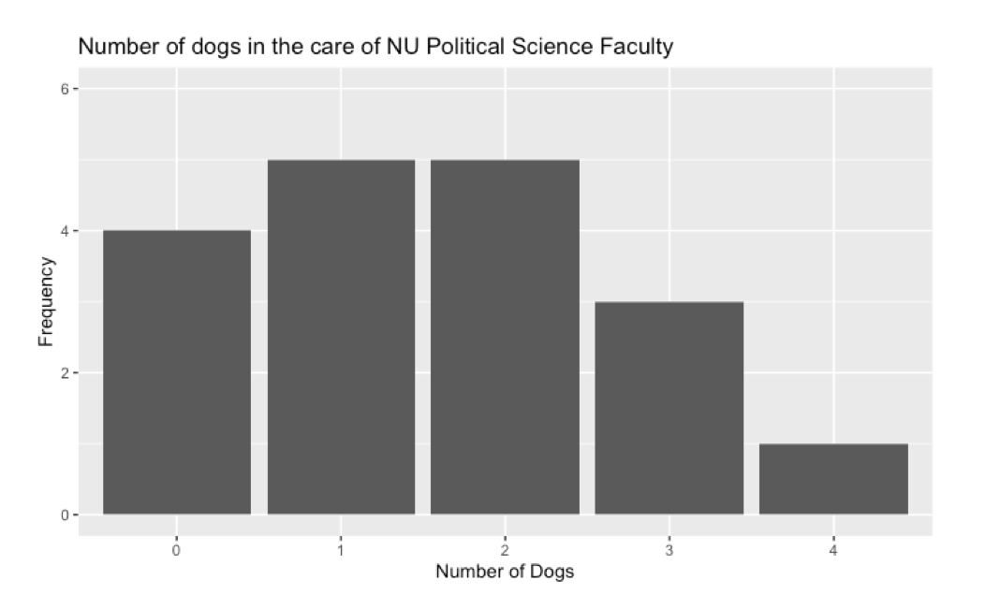
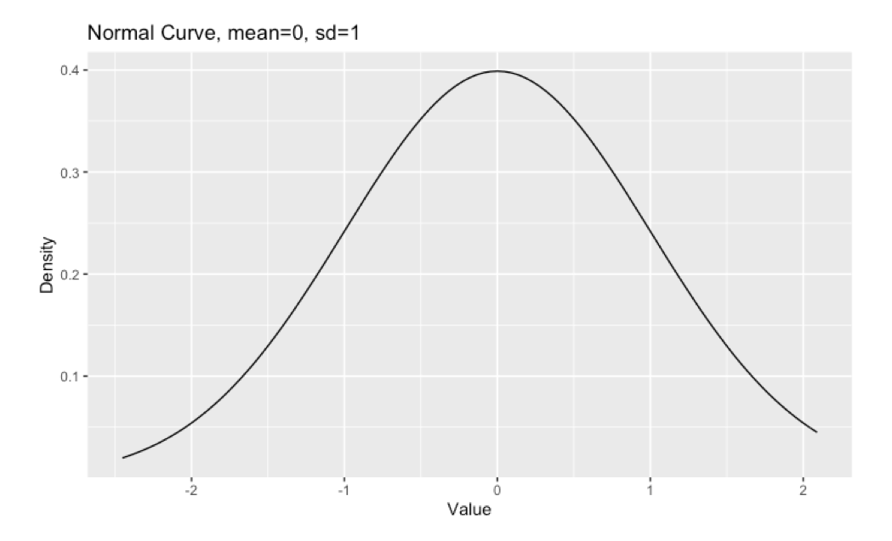
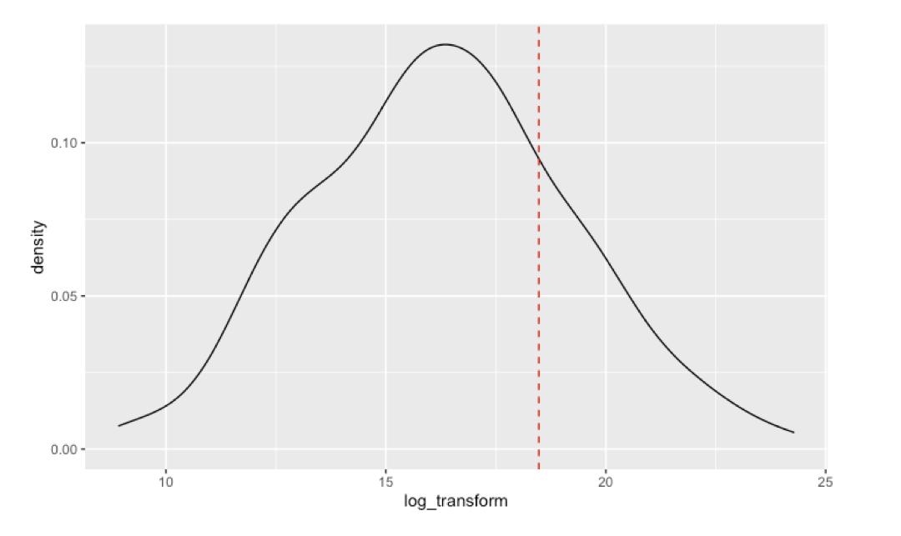

# Day 7 Agenda 

- What are probability and statistics? 

- Concepts in probability  

- Random variables-- discrete and continuous 

# -- 

Previous days have been very math heavy and reviews of basic concepts from classes you may have taken long ago. Today's class is more concept heavy and may visit material you have never been exposed to before. We will review many of these things a second time around in 403. 

It's okay if this is just greasing the wheels. 

# Probability Theory and the Social Sciences 

>- Probability theory is foundational to quantitative social science, as it is a means to derive the uncertainty of an outcome given a set of potential outcomes. 

>- Probability is the basis for statistical theory. Probability allows us to make statements about likelihood \textit{ex ante}, whereas statistics deciphers the underlying probability structure \textit{ex post facto}, that is after data collection. 

>- This course and most other statistics courses will cover \textbf{frequentist} statistics, which is based on objective probability. Other frameworks, like rational choice theory and Bayesian statistics, follow subjective probability. 


# Probability Concepts 

:::{.block}

## Outcome 
Any specified event that might occur. 
::: 

Example: How many possible outcomes are there when rolling a 6-sided die? 

\small \uncover<2->{$\rightarrow$ There are 6 possible outcomes.}


\pause

::: {.block}

## Event 
A specified outcome or set of outcomes. 
:::

\pause 

\small 
Example: Define the number of outcomes of the event that a 6-sided die lands on any number $\leq 2$.

\small \uncover<4->{$\rightarrow$ The defined event has 2 possible outcomes.}


# Probability Concepts 

:::{.block}
## Sample Space ($\Omega$)
A list of ALL possible outcomes.
:::

\small What is the sample space of rolling a 6-sided die? 
\newline \small \uncover<2->{$\rightarrow \Omega=\{1, 2, 3, 4, 5, 6\}$}

# Annotating Probability 

Probability and statistics will rely on the set notation we reviewed in Day 3. Revisit those slides in case you get stumped. 

# Calculating Probability 

It's likely you have learned the following formula to calculate simple probability: 
$$Pr(\text{event})=\frac{\# \space \text{outcomes in event}}{\# \space \text{total outcomes in sample space}}$$
\pause 
For example, in the case of the 6-sided die, what is the simple probability that the die lands on a number $\leq 2$?

\uncover<3->{First, we can define the sample space as before, where $S=\{1,2,3,4,5,6\}$. There are 6 total outcomes in the sample space.}

\uncover<4->{Then, we can determine the number of pertinent outcomes are in the event, here it is 2, such that $E={1,2}$.}

\uncover<5->{Therefore, we are interested in the $Pr(\text{Die}=1, 2)$. This is 2 outcomes out of 6, which simplifies to $\frac{1}{3}$.}

# BUT

But things are rarely so simple $\ddot\frown$. 

\pause 

Independence, mutual exclusivity, and collective exhaustiveness are all important properties to ensure you are calculating probability correctly. 

Determining whether an event meets these criteria will be tricky, and we will not cover this all today. 

Here, we will cover some general procedures of probability and then get into these concepts. 


# Some General SOP and Rules

Suppose we are interested in event A. The probability of event is denoted $Pr(A)$. 

\uncover<2->{Probability will always lie in the range $[0,1]$, where 0 indicates that $A$ cannot happen (i.e., is improbable) and 1 indicates the event will deterministically happen.}

\uncover<3->{Furthermore, the law of total probability states that the total probability of a sample space is 1. Therefore, when we sum together probabilities of all events in a sample space, the total probability equals 1.}

# Some General SOP and Rules

\uncover<1->{If $Pr(A)$ is notated alone, we can also assume that we are calculating the probability \textit{independently} of any other event OR that we have already considered any other conditional event.}

\uncover<2->{In the case that we are interested in the probability of a concurrence of events, that is one more events happening together but not necessarily conditionally, we can calculate the joint probability. There are different types of joint probability, based on if we want to know the intersection ($\cap$) or the union ($\cup$) of events.}

\uncover<3->{We can also account for the conditional probability of $A$ given some other event $B$. This is annotated $Pr(A|B)$ and read as the probability of $A$ given or conditional on $B$.}

# Independence 

Two or more events are independent if the probability that any one of them may occur does not depend on the occurrence of another. 

\uncover<2->{Example: The probability that it rains today is independent from the probability that it is anyone's birthday in this room.}


\uncover<3->{Formally, statistical independence\footnote{ Slide developed from 3https://doi.org/10.1007/978-0-387-31439-6} between two events, $A$ and $B$, is given by: 
$$P(A|B)=P(A) \space ; \space P(B|A)=P(B)$$
This can be generalized to all events $A_1,...,A_n$ that are independent if and only if (iff) $P(\cap^n_{i=1}A_i)=\prod^n_{i=1}P(A_i)$.}

# Mutual Exclusivity 

Two events or more events are mutually exclusive if they cannot co-occur. You may also hear that two events are mutually exclusive if the events are disjoint. 

\uncover<2->{Example: The event that you were born in a given country is mutually exclusive of the event that you were born in another country. You (in simplest terms) cannot have been born in two countries.}

\uncover<3->{Therefore, mutual exclusivity\footnote{https://www.intmath.com/counting-probability/9-mutually-exclusive-events.php} states that the probability of two events, $A$ and $B$ co-occurring is 0: 
$$ P(A \cap B) = 0$$}

# Mutual Exclusivity 

We can visualize mutual exclusivity as a Venn diagram, revisiting some of the ideas from our Logic section: 

\begin{figure}
\centering
\begin{tikzpicture} 
\node[] at (-1.25,0) {Event A};
\draw[color=blue] (-1.25,0) circle (1cm);
\node[] at (1.25,0) {Event B};
\draw[color=blue] (1.25,0) circle (1cm);
\end{tikzpicture} 
\end{figure}

\uncover<2->{Note that there is no overlap between the two circles, indicating that there is no $\cap$.}

# Collectively Exhaustive

All events cover the probability sample space, in other words, at least one of them is going to happen.\footnote{https://www.statisticshowto.com/collectively-exhaustive/} 

\uncover<2->{Example: When rolling a 6-sided die, the events are collectively exhaustive as the probability that any of the events happens is 1. We know that a roll guarantees that the die will land on one of the numbers.}

\uncover<3->{Events are thus collectively exhaustive if the union of all possible event outcomes covers the sample space: 
$$ A \cup B = S$$}

# Joint Probability 

Sometimes we want to know the probability of the concurrence of events. In the case that two concurrent events are independent, calculating the probability is simple. The joint probability of independent events is merely the product of the probabilities: 
$$P(A \cap B) = P(A)P(B)$$ 

\uncover<2->{Example: Let's say you are drawing 2 balls from 2 different urns. Each of the urns has 2 red balls, 2 white balls, and 4 black balls. Assuming that the draws from each urn are independent of one another, what is the probability that you choose a black ball from each of the urns?}
\uncover<3->{$$P(B_{\text{Urn 1}})= \frac{4}{8}; P(B_{\text{Urn 2}})= \frac{4}{8}$$
$$P(B_{\text{Urn 1}} \cap B_{\text{Urn 2}})= P(B_{\text{Urn 1}}) \times P (B_{\text{Urn 2}}) = \frac{4}{8}\times\frac{4}{8}= {1\over 4}$$}

# Joint Probability, cont'd. 

In other cases, we might want to know about the concurrence of events that are mutually exclusive and independent. This is the case that we want to know about Event A \textbf{or} Event B happening. The joint probability of mutually exclusive events is the sum of the probabilities: 
$$P(A \cup B) = P(A)+P(B)$$ 

\uncover<2->{Example: Let's say you want to calculate the probability that a randomly chosen adult in Chicago voted for Trump or Biden in the last election. Let's say that the probabilities are respectively P(Trump)= 0.35, P(Biden)=0.60. What is the probability that a randomly chosen person voted for Trump OR Biden?}
\uncover<3->{$$ P(\text{Trump})=0.35, P(\text{Biden})=0.60$$
$$P(\text{Trump} \cup \text{Biden})= 0.35+0.60 = 0.95$$}

\uncover<4->{\small Why are these events mutually exclusive? Are they collectively exhaustive?}

# Joint Probability, cont'd. 

For events that are independent but NOT mutually exclusive, we still want to take into account the union of the probabilities we need to somehow account for the overlap of the events.

In this case, the joint probability is the sum of the probabilities minus their intersection: 
$$P(A \cup B) = P(A)+P(B)-P(A \cap B) $$ 

\uncover<2->{Returning to the example of the urns, let's say you are drawing 2 balls from 2 different urns. 

Each of the urns has 2 red balls, 2 white balls, and 4 black balls. What is the probability that you draw a black ball from urn 1 OR urn 2?}
\uncover<3->{$$P(B_{\text{Urn 1}})= \frac{4}{8}; P(B_{\text{Urn 2}})= \frac{4}{8}$$
\small{$$P(B_{\text{Urn 1}} \cup B_{\text{Urn 2}})= P(B_{\text{Urn 1}}) + P (B_{\text{Urn 2}}) -  P(B_{\text{Urn 1}} \cap B_{\text{Urn 2}})= \frac{4}{8} + \frac{4}{8} - \frac{1}{4}= {3 \over 4}$$}}

# Random Variables 

The concept of \textbf{random variables} is one of the most important and fundamental aspects to modeling quantitative social science. 

A random variable is any concept whose value can be modeled probabilistically. The potential range of values of a given random variable and the values' associated probability structure is the probability distribution. 

Probability distributions can be modeled as equations. The type of distribution function associated with a given probability structure will depend on whether a random variable is \textbf{discrete} or \textbf{continuous}. More on this to come. 

\uncover<2->{What are some examples of random variables that we might encounter in the social sciences?}

# Probability Distributions and Additional Terminology 

Probability distributions and their associated random variables have a range of possible values where $Pr>0$, this range of possible values is known as the distributional \textbf{support}. 

For example, in a Bernoulli distribution, often used for measuring the likelihood of success in a single trial, the support is $\{0,1\}$ where 0 is failure and 1 is success.\footnote{This is notated as $k \in \{0,1\}$.}

# Discrete Random Variables \footnote{https://tinyurl.com/2p94ax59}

Random variables (r.v.) take on different functional forms given the types of quantities or values that they represent. 

\uncover<2->{\textbf{Discrete} r.v. model countable, distinct values.}

\uncover<3->{Examples of discrete r.v. include the number of children in a classroom, the number of crosswalks in a neighborhood, or the number of degrees that a person holds.}

\uncover<4->{The associated probability distribution of a discrete r.v. is the \textbf{probability mass function (p.m.f.)}.}

\uncover<5->{Discrete r.v. are graphically shown via \textbf{histograms}, which are bar chart representations of frequencies over a range of values.}

# Histograms 
\small :et's say we surveyed members of the Political Science Dept. for the number of dogs each person has in their household. The following graph shows the frequency of each value given by the surveyed individuals. 

{width=60%}

# Probability Mass Functions (p.m.f.)

A \textbf{probability mass function (p.m.f.)} is the way to functionally describe the probability associated with each potential value ($k$) of a discrete r.v. $X$.\footnote{Formally, $P(X=x_i)=p_i$} 

\uncover<2->{Remember that the probabilities are bounded as [0,1] and that all the total probability of all values in a sample space $\Omega$ sum to 1. }

\uncover<3->{We can think through an applied example, using the previous histogram's data.}

# p.m.f. Example 

Recall that the graph was of the number of dogs in the care of NU PoliSci faculty and that a histogram shows the frequency of each observation in the data. We can also display this in a table: 

\begin{table}
\centering
\caption{Number of Dogs in the Care of PoliSci Faculty}
\begin{tabular}{|c|c|}
\hline 
No. of Dogs & Frequency\\ 
\hline 
0 & 4\\ 
\hline 
1 & 5\\ 
\hline 
2 & 5 \\ 
\hline 
3 & 3 \\ 
\hline 
4 & 1 \\ 
\hline 
\end{tabular}
\end{table}

\uncover<2->{Given what we know about the distribution, what is the probability that any faculty member cares for 1 dog? Suppose that this data accounts for all the professors in the department. }

# p.m.f. Example 

We know a few things right off the bat from the histogram and the table. First, the range of possible values, i.e. the sample space, is 0 to 4. Second, we know that our $n$, or the total observations, is 18. From here it is pretty easy to construct a p.m.f. We merely calculate the probability for each observed value, such that: 


\begin{equation*}
p(x)=\begin{cases}
    \frac{4}{18} & \text{if}\, k=0 \\
    \frac{5}{18} & \text{if}\, k=1,2  \\
    \frac{3}{18} & \text{if}\, k=3  \\
    \frac{1}{18} & \text{if}\, k=4  \\
    0 & \text{otherwise}
    \end{cases}
\end{equation*}

\uncover<2->{What is the probability that any faculty member cares for 1 dog?}

\tiny{Notice that we can include the probabilities of 1 and 2 together on the same line because they are equal, this does not mean that is the sum of those probabilities.} 

```{r, include=F, eval=F}

dogs<-c(rep.int(4, 1), rep.int(3, 3), rep.int(2, 5), rep.int(1,5), rep.int(0,4))

dogs<-data.frame(dogs)
dogs$dogs<-as.factor(dogs$dogs)

ggplot(dogs, aes(dogs))+
  geom_histogram(stat='count')+
  ylim(0,6)+
  xlab("Number of Dogs")+
  ylab("Frequency")+
  ggtitle("Number of dogs in the care of NU Political Science Faculty")
?geom_histogram
```

# Continuous Random Variables  \footnote{https://tinyurl.com/2p94ax59}

\textbf{Continuous} r.v. can take on an uncountable, infinite range of values. 

\uncover<2->{Examples of continuous r.v. include annual rainfall in Chicago, gross domestic product, or the amount of oil imported to a country on a monthly basis.} 

\uncover<3->{The functional form of a continuous r.v. is given by the \textbf{probability density function} (p.d.f.).} 

\uncover<4->{Given that a continuous r.v. has an infinite range of possible values, it is not possible to calculate the probability at any specific value. Instead, we calculate the probability given a function of a \textbf{density curve}.}

\uncover<5->{A density curve is a smoothed line that displays a distribution function.}

# Density Curve 

For example, the Normal distribution is one of the most commonly known density curves. Let's say you have some data that you have standardized with mean 0 and standard deviation 1 (we will get to estimating central tendencies soon!), this is how the density curve would look! 

{width=70%}
```{r, eval=F, include=F}
set.seed(2)
x<-rnorm(50)
x<-data.frame(x)
normal_curve<-ggplot(x, aes(x))+stat_function(fun=dnorm)+xlab("Value")+ylab("Density")+ggtitle("Normal Curve, mean=0, sd=1")
```

# Probability Density Function (p.d.f.) \footnote{https://online.stat.psu.edu/stat414/lesson/14/14.1}

\uncover<1->{Given that any given value of a continuous r.v. $X$ has a zero probability,\footnote{Formally, this is $P(X=x)=0$.} we think differently about what a probability function models for a continuous r.v.}

\uncover<2->{In a \textbf{probability density function (p.d.f.)} of a continuous r.v. we define the probability over a range of potential values.}

# Probability Density Function (p.d.f.) 

We can motivate understanding the p.d.f. with an example. Let's say that you have some data on $CO_2$ emissions by each country over the last 10 years. The possibilities of any given country having a specific value of emissions, let's say 106.52 million tons, is 0. Instead, we can estimate the probability that any given country had less than 106 million tons in 2020.  

\uncover<2->{So, what we really hope to estimate is $Pr(X<106 \text{million}\space t)$.} 

# p.d.f. Example, cont'd. 

The below curve is country-level emissions data from 2020. The dotted line shows our threshold value of 106 million tons.\footnote{The data has been log transformed for readability, meaning all values are just taken as their natural log.}

{width=70%}

```{r, eval=F, include=F}
emissions<-read.csv("/Users/sarahmoore/Downloads/annual-co2-emissions-per-country.csv")
emissions %>% filter(Year==2020) ->emissions
emissions$log_transform<-log(emissions$Annual.CO2.emissions)
ggplot(emissions, aes(log_transform))+
  geom_density()+
  geom_vline(xintercept=18.47895, linetype="dashed", color="red")
  
emissions$fill<-ifelse(emissions$log_transform<18.47895, 1, 0)
?stat_density
log(106000000)#18.47895
```

# p.d.f. Example, cont'd. 

To find the probability that a given country's 2020 emissions were less than 106 million tons, we then find the area under the curve to the left of our threshold value.

We will leave the actual calculation for a later time, but just by looking at this curve, what do you think the probability is that a country's emissions were less than 106 million tons?

# p.d.f. Example, cont'd. 

{width=65%}

Remember that the law of total probability states that the probability over the entire sample space is equal to 1. This means that the entire area under our probability curve is 1.

What percentage of the curve do you feel is accounted for up to the dotted line?

# p.d.f. 

While this example was motivated by a fairly easy range of values, others might be more tricky. 

\uncover<2->{Instead, we might think about the probability of lying within a range of two values, such that we need to calculate $P(a<X<b)$.}

\uncover<3->{We will cover all of this more in depth at a later time, but for now this is enough to see as to how the previous days' concepts tie into probability.} 

\uncover<4->{Here is the takeaway: \textbf{We can model probability and likelihoods via functions. Calculating probability at given values then becomes an issue of finding a function's location and behavior at that value.} This is a lot, and you won't get it all right now, THAT'S OK!}


# Discussion 

Why do we need to know the difference between discrete r.v. and continuous r.v.? 

\uncover<2->{A lot of how social science models things is dependent on the types of variables modeled and how we measure them.} 

\uncover<3->{For example, how we model the probability of a vote choice between two candidates (i.e. a discrete variable) is different than how we would model the variation in resource depletion per year (i.e. a continuous variable).}

\uncover<4->{Understanding the underlying probability structure of different variable types will be an important foundation for developing more advanced modelling skills down the road.}

\uncover<5->{Even still, understanding types of random variables and the appropriate tools to assess their behavior is important in rudimentary analyses-- such as t-tests.}